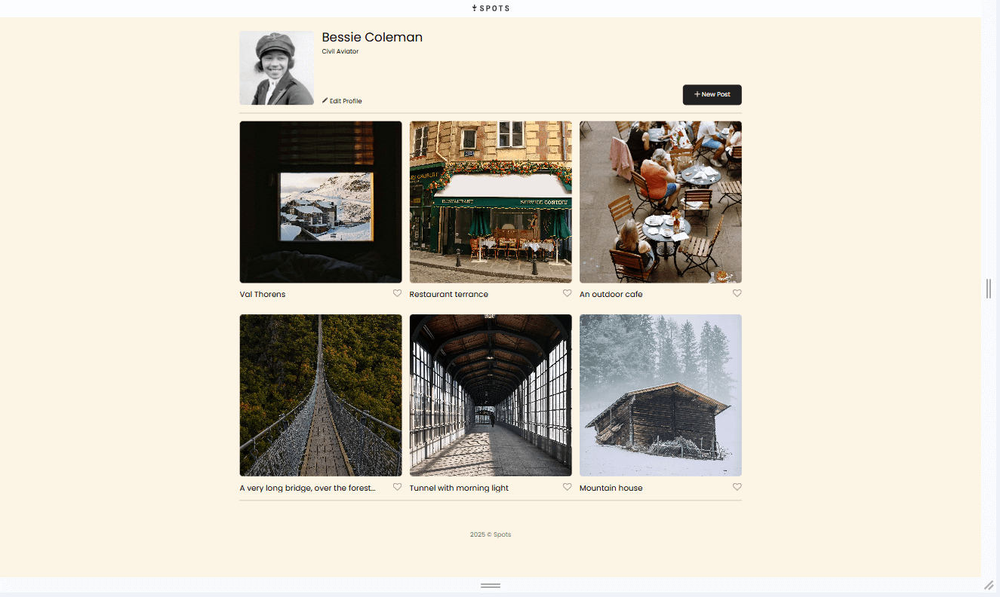
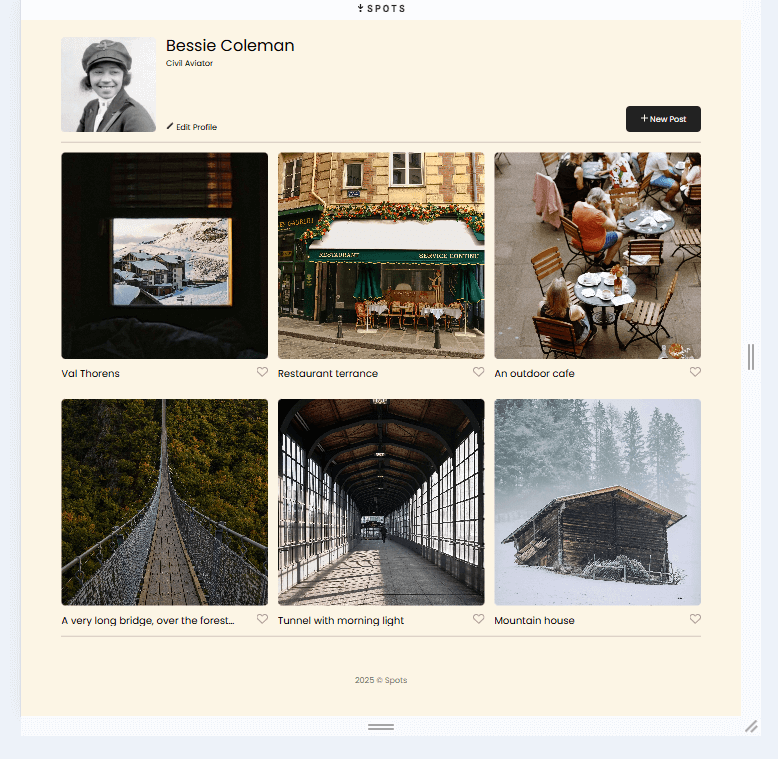
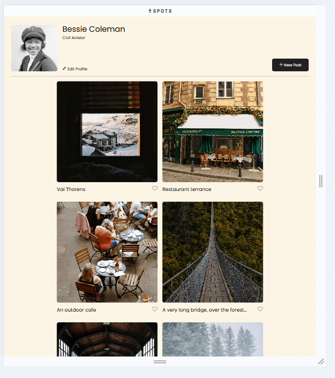
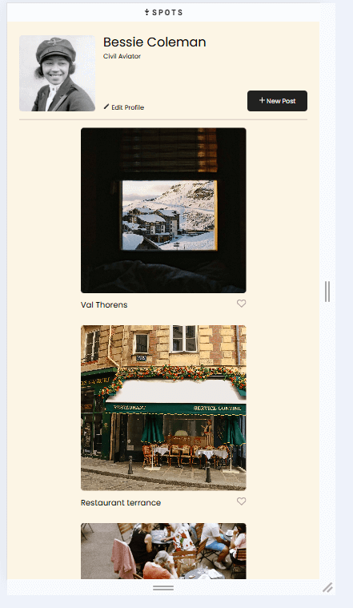
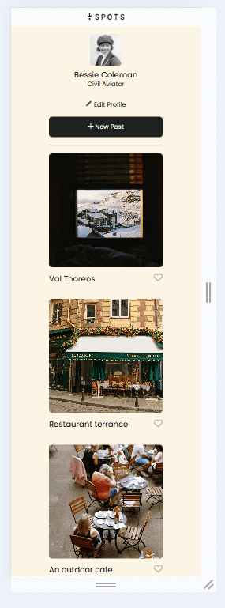
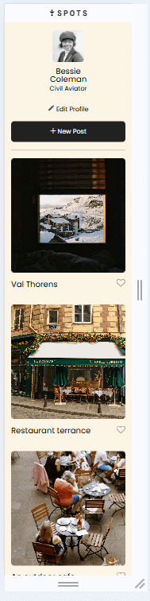

# Project 3: Spots

An social profile site for image sharing.

## Description

Main features are : responsive css layout for multiple screen sizes, clean theme for posting images, and clean design for the user. Section for image description and a like button for other users to express. In addition no horizontal bar *thunbs up*.

### Tech Stack & Featrues

* HTML
* CSS
* Responsive Design
* Figma
* Github pages
* VS Code

* Header : Site logo.
* Profile section : User Profile Picture, User Name, User description, User option to edit profile after. 
* Content : Post button to post new images, designated area to group pictures, image description bar, image like button. 
* Footer : Copyright Title.
  
**Deployment**  
  

  
**Images**  
  

  
Thank you for reading! 
